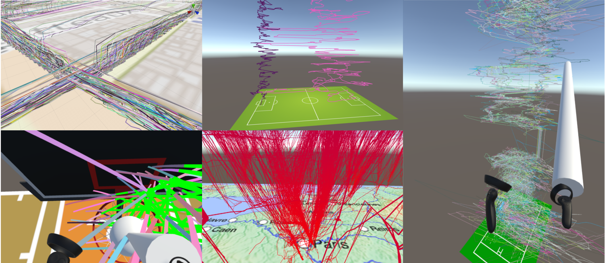

# ReViVD
**Github Repository - PAr 118 - ReViVD (2018-2019)**

**Full name: 3D data exploration with Virtual Reality Headset (aircraft trajectories, sports data)**


## Objective
The main objective is to develop new 3D data visualization and exploration tools in Virtual Reality. We intend, through the ReViVD project, to showcase methods of interacting with data in VR which are simply not possible in other desktop configurations.

## Bibliography
References of the project can be found on our [website](https://amigocap.github.io/ReViVD/bibliography/).

## Docs
Some documentation can be found on our [website](https://amigocap.github.io/ReViVD/documentation/).

## JSON File Example
```json
{{md  'ReViVD//External Data/example.json'}}
```


## Roadmap
- [x] Research on the state of the art of VR technologies
- [x] Bibliography
- [x] Headset test and configuration of programming environment
   - [x] First demo with basic examples
   - [x] Visualization demo
   - [x] Creation of our own LineRenderer and RubanMaker
   - [x] Aircraft Visualization
   - [x] New code architecture
- Optimization of data visualization
   - [x] Creation of districts
   - [x] Custom shader
- Interaction with data
   - [x] Handling controllers
   - [x] Filter data
   - [x] Moving camera
   - [x] Standardized, combinable 3D selectors
   - [x] More functionality for selectors: erasers, negative space
   - [x] In-program selector creator
