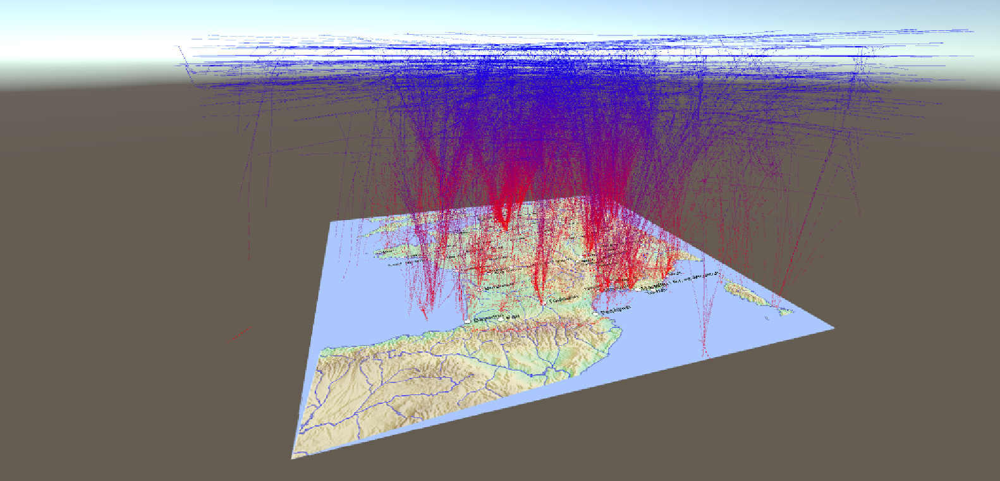

# ReViVD
**Github Repository - PAr 118 - ReViVD (2018-2019)**

**Full name: 3D data exploration with Virtual Reality Headset (aircraft trajectories, sports data)**

## Objective
The main objective is to develop new 3D data visualization and exploration in Virtual Reality.
We intend, through the ReViVD project, to showcase options of interacting with data that are exclusive to VR. One of our objectives is to develop VR interactions with data that are simply not possible with other desktop configurations.

## Bibliography
References of the project can be found in the *annotated_bibliography.md* file.

## Roadmap
- ~~State of the art of VR technologies~~
- ~~Bibliography~~
- ~~Headset test and configuration of programming environment~~
   - ~~First demo with basic examples~~
   - ~~Visualization demo~~
   - ~~Creation of our own LineRenderer and RubanMaker~~
   - ~~Aircraft Visualization~~
   - ~~New code architecture~~
- Optimization of data visualization (ongoing)
   - ~~Creation of districts~~
   - Own shader
   - Multithreading
   - Distribution on several frames
- Interaction with data (ongoing)
   - ~~Handling controllers~~
   - Filter data
   - ~~Moving camera~~
   - ...

## Docs
Some documentation can be found under the *docs* folder.

