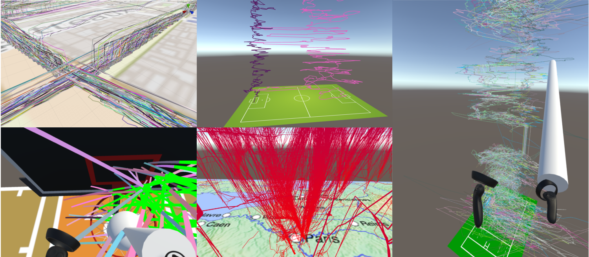

# Objective

ReViVD's main objective is to develop new 3D data visualization and exploration tools in Virtual Reality. We intend to showcase methods of interacting with data in VR which are simply not possible in other desktop configurations.
# Source code

You can find the source code for ReViVD at GitHub:
[AmigoCap][amigocap-organization] /
[ReViVD](https://github.com/AmigoCap/ReViVD)

[amigocap-organization]: https://github.com/AmigoCap
