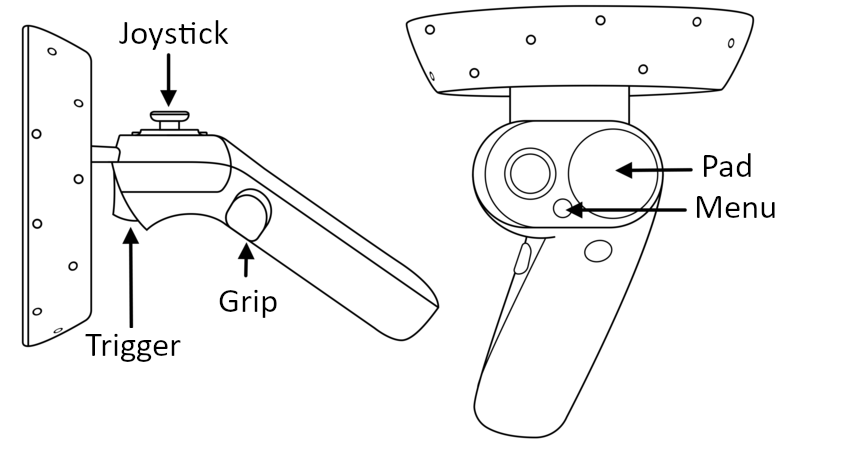
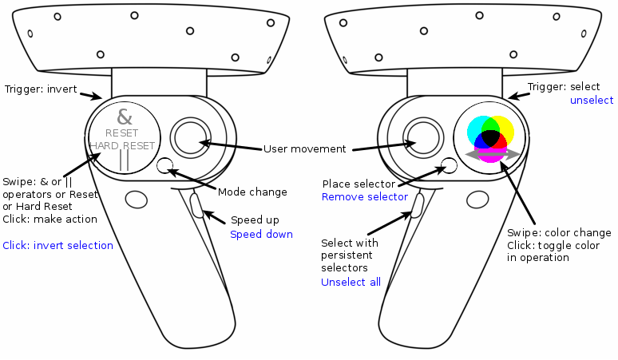
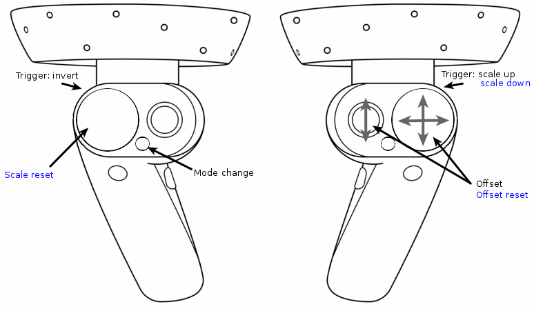

# Installation instructions

## Using the last release
Requirements: SteamVR

* Download and install [Steam](https://store.steampowered.com/about/?l=french)
* Setup a VPN to pass through the restrictions of your network if necessary
* Setup [Steam VR](https://store.steampowered.com/steamvr?l=french)
* Setup [Windows Mixed Reality for Steam VR](https://store.steampowered.com/app/719950/Windows_Mixed_Reality_for_SteamVR/)
* Extract the archive from [here](https://github.com/AmigoCap/ReViVD/releases) and launch ReViVD.exe after ensuring that Windows Mixed Reality loaded properly when you plugged in your headset.
* Indicate the path to your json file that describes your binary dataset. See the **JSON File Example** for details on how to format your json file.

## Cloning the source code
 
### Windows Mixed Reality setup

* Plug in your HMD to launch the Windows Mixed Reality App
* Setup your headset and controllers

### Unity setup

* Download and install [Unity3D](https://unity3d.com/fr/get-unity/download) (you can use Unity Hub to manage several Unity versions). For optimal compatibility, use version 2019.1.9f1
* Setup Visual Studio to be the Unity Script Editor. [HowTo](https://code.visualstudio.com/docs/other/unity)
* Add the OpenVR (Standalone) package using the Package Manager Window.

### Steam setup

* Download and install [Steam](https://store.steampowered.com/about/?l=french)
* Setup a VPN to pass through the restrictions of your network if necessary
* Setup [Steam VR](https://store.steampowered.com/steamvr?l=french)
* Setup [Windows Mixed Reality for Steam VR](https://store.steampowered.com/app/719950/Windows_Mixed_Reality_for_SteamVR/)

### Unity project setup

* Clone the [ReViVD](https://github.com/AmigoCap/ReViVD) repository; the Unity project folder is the ReViVD folder inside the main folder
* Download data into an **External Data** folder and use your VR headset to interact with it


# JSON File Example

```
/*
json file example for airtraffic data adapted from http://recherche.enac.fr/~hurter/FromDaDy.html
This json file describes your binary file to let ReViVD know how to read your dataset.
*/
{
  //The path attribute names to use as id and/or as number of atoms, keep it void ("") if it doesn't apply to your dataset. The names must match with the ones in the path attributes array of this json.
  "pathAttributeUsedAs_id": "id",
  "pathAttributeUsedAs_n_atoms": "n",
  
  //The atom attribute names to use as x, y, z (mandatory) and/or as t and color, keep it void ("") if it doesn't apply to your dataset. The names must match with the ones in the atom attributes array of this json.
  "atomAttributeUsedAs_x": "x",
  //y attribute is the vertical axis (toward the sky)
  "atomAttributeUsedAs_y": "altitude",
  "atomAttributeUsedAs_z": "z",
  "atomAttributeUsedAs_t": "t",
  "atomAttributeUsedAs_color": "altitude",
  
  //Name of the binary file to load, must be in the same folder of this json file.
  "filename": "airtraffic",
  
  //If you have several binary files split by instants, turn the following option to true, set the number of instants per file and fill in the suffix of the first file (assuming that it is an incremental int)
  "severalFiles_splitInstants": false,
  "splitInstants_instantsPerFile": 50,
  "severalFiles_firstFileSuffix": "0001",
  
  //Binary endianness
  "endianness": "little",
  
  /* District size of the visualization
   * Used for collision detection optimization with selectors
   * Bigger districts are generally better for big selectors
   * Smaller districts are generally better for small selectors and very atom-dense visualizations
   * Try to fiddle around with those values if you find selection performance lacking.
   * Cubical districts are not mandatory but will go faster, especially on isotropic visualizations;
   * However, if a visualization is very atom-dense on only one axis, try reducing the district size on that axis.
   */
  "districtSize": {
    "x": 40.0,
    "y": 40.0,
    "z": 40.0
  },
  
  //Coordinates of the lower truncature point
  "lowerTruncature": {
    "x": -10000.0,
    "y": -10000.0,
    "z": -10000.0
  },
  
  //Coordinates of the upper truncature point
  "upperTruncature": {
    "x": 10000.0,
    "y": 10000.0,
    "z": 10000.0
  },
  
  //Number of paths in the entire dataset
  //Can be left blank / too large if unknown, at your own risks.
  "dataset_n_paths": 4309,
  
  //Display all paths in the dataset if set to true. 
  "allPaths": true,
  
  //If allPaths is false, those paramaters handle the sampling of paths.
  "randomPaths": false,
  "chosen_n_paths": 4309,
  "chosen_paths_start": 0,
  "chosen_paths_end": 4309,
  "chosen_paths_step": 1,
  
  //Number of instants in the dataset, set it to a large number or leave it blank if unknown.
  //Will be overriden by pathAttributeUsedAs_n_atoms if it is defined.
  "dataset_n_instants": 2147483647,
  
  //Display all instants in the dataset if set to true. 
  "allInstants": true,
  
  //If allInstants is false, those paramaters handle the sampling of instants.
  "chosen_instants_start": 0,
  "chosen_instants_end": 200,
  "chosen_instants_step": 1,
  
  //If true x and z axis will be interpreted as latitude and longitude (decimal degree)
  "useGPSCoords": false,
  
  //Set the origin of the visualization to be at these specific GPS coordinates
  "GPSOrigin": {
    "x": 0.0,
    "y": 0.0
  },
  
  //Control of the parameters of the spheres animation: radius, animation speed, beginning time of the animation and if spheres are display.
  "spheresRadius": 2.0,
  "spheresAnimSpeed": 1.0,
  "spheresGlobalTime": 0.0,
  "spheresDisplay": false,
  
  //array of asset Bundles to load with the visualization, keep it empty ([]) if it doesn't apply to your dataset.
  "assetBundles": [
    {
	  //Name of the asset bundle
      "name": "airtraffic_map",
	  
	  //Filename of the asset bundle to load, must be in the same folder of this json file.
      "filename": "airtraffic_map",
	  
	  //If set to true, let you override the position, rotation and scale of the asset bundle.
      "overrideBundleTransform": false,
      "position": {
        "x": 0.0,
        "y": 0.0,
        "z": 0.0
      },
      "rotation": {
        "x": 0.0,
        "y": 0.0,
        "z": 0.0
      },
      "scale": {
        "x": 0.0,
        "y": 0.0,
        "z": 0.0
      }
    }
  ],
  
  //Path attributes array, keep it empty ([]) if it doesn't apply to your dataset.
  "pathAttributes": [
    {
	  //Name of the attribute, if the attribute is used as id or n_atoms the names must match! 
      "name": "id",
	  
	  //Type of the attribute : int32, float32, int64 or float64.
      "type": "int32"
    },
    {
      "name": "n",
      "type": "int32"
    }
  ],
  
  //Atom attributes array.
  "atomAttributes": [
    {
	  //Name of the attribute, if the attribute is used as x, y, z, t or color the names must match!
      "name": "t",
	  
	  //Type of the attribute : int32, float32, int64 or float64.
      "type": "float32",
	  
	  //Position offset if the attribute is used as an axis
      "positionOffset": 0.0,
	  
	  //Size multiplier if the attribute is used as an axis; applied after position offset
      "sizeCoeff": 1.0,
	  
	  //Those parameters handle the color interpolation if this attribute is used as color
      "colorStart": "Blue",
      "colorEnd": "Red",
	  
	  //If set to true, color interpolation is done between the min and max values of this attribute
      "valueColorUseMinMax": false,
	  
	  //If valueColorUseMinMax is false, color interpolation is done between those two values
      "valueColorStart": 0.0,
      "valueColorEnd": 1.0
    },
    {
      "name": "x",
      "type": "float32",
      "positionOffset": 0.0,
      "sizeCoeff": 1.0,
      "colorStart": "Blue",
      "colorEnd": "Red",
      "valueColorUseMinMax": true,
      "valueColorStart": 0.0,
      "valueColorEnd": 1.0
    },
    {
      "name": "z",
      "type": "float32",
      "positionOffset": 0.0,
      "sizeCoeff": 1.0,
      "colorStart": "Blue",
      "colorEnd": "Red",
      "valueColorUseMinMax": true,
      "valueColorStart": 0.0,
      "valueColorEnd": 1.0
    },
    {
      "name": "altitude",
      "type": "float32",
      "positionOffset": 0.0,
      "sizeCoeff": 1.0,
      "colorStart": "Blue",
      "colorEnd": "Red",
      "valueColorUseMinMax": true,
      "valueColorStart": 0.0,
      "valueColorEnd": 1.0
    }
  ]
}
```

# VR recording
To record what the user does in VR, you can use [OBS](https://obsproject.com/download) with the [OpenVR input plugin](https://obsproject.com/forum/resources/openvr-input-plugin.534/).

# Input mapping

The next figure displays the input mapping used in ReViVD: 


ReViVD has 2 modes: 
* a selection mode in which the user perform the selection of trajectories with the selectors
* a creation mode in which the user can edit the primitive used into the selection process.

## Selection mode

In selection mode, the user perform the selection of trajectories with the selectors. 
Like in a video game, the joysticks of the controllers monitor the movement of the user in the world space. Movement speed can be increased pressing the left grip.

To perform a selection, the user has to hold the right trigger and all trajectories in collision with the selector will be selected. The right menu button places a persistent selector at the current location of the selector, to select with the persistent selectors, the user has to press the right grip.
By swiping the right pad, the user changes the color and the selector.

The left pad allows the user to achieve boolean operations on the selected trajectories. Swiping the left pad provides several options: OR, AND, RESET and HARD RESET operators. To add or remove colors in the operation, the user has to click on the right pad to toggle the colors available in the operation.

Holding the left trigger allow the user to perform most of the opposite actions of the actions we have previously detailed. The next figure summarizes the input mapping in the selection mode, in blue are the actions available in invert mode (while holding the left trigger).




## Creation mode

In creation mode, the user can edit the primitive used into the selection process. \\
With the right joystick and pad, the user can edit the offset of the primitive relative to the right controller. Holding the right trigger scales up the primitive whereas holding the left one allows the user to perform the opposite actions.

For the cuboid and cylinder primitives, with the left joystick and pad, the user can edit some parameters of the scale of those primitives: length, width, height or radius.\\
The next figure summarizes the input mapping in the creation mode.




